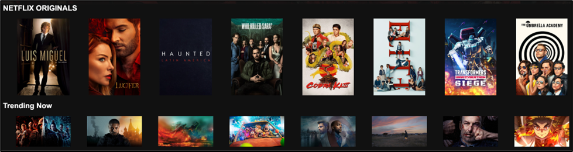
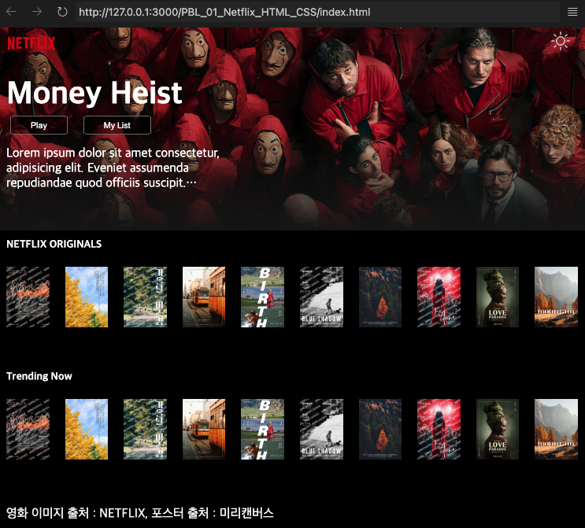
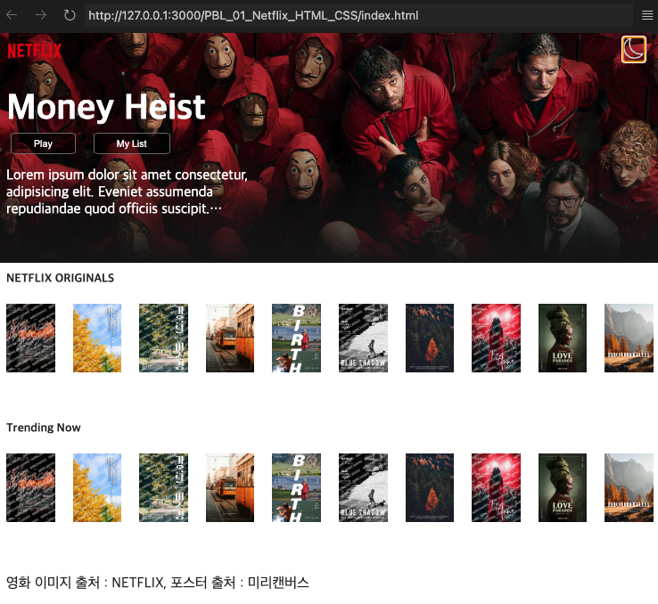

## PBL 과제 : HTML/CSS를 이용해서 넷플릭스 사이트 만들기

구름 KDT 수업의 첫번째 과제입니다.
1. 요구 사항



```
- Flex Box로 영화 나열.
- 영화에 마우스로 하버 시, 이미지의 사이즈가 크게 될 수 있게 함.
- 따라서, Flex, CSS 변수를 사용했습니다.
```

2. 제작 결과

> 2.1. dark 테마


> 2.2. light 테마
