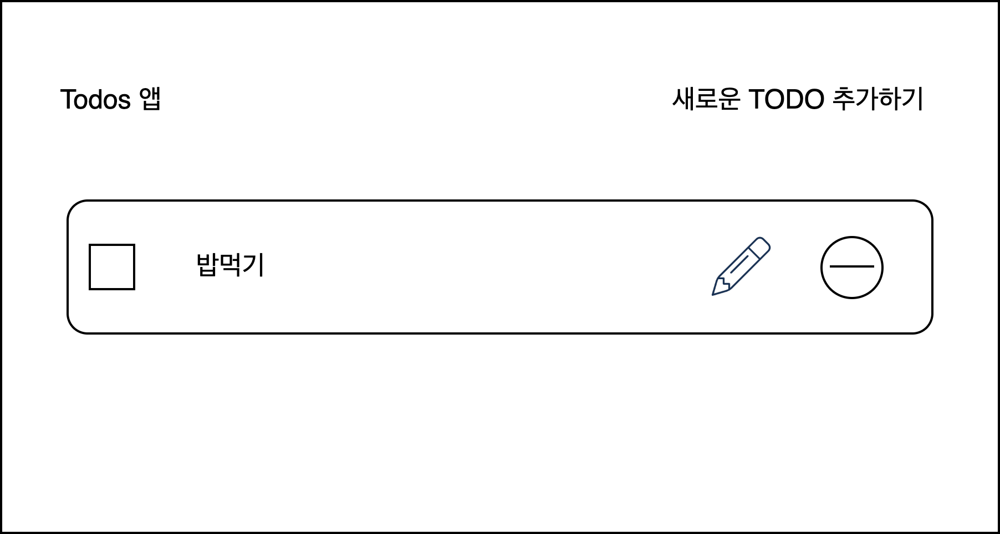

## PBL 과제 : HTML/CSS를 이용해서 넷플릭스 사이트 만들기

구름 KDT 수업의 두번째 과제입니다.
1. 요구 사항


```
- mission: Todo 앱 만들기
- 하위과제 :
> 변수명을 최대한 명확하게 하며, 함수는 최소한의 단위로 나눠서 사용.
> 페이지를 새로고침 해도 데이터가 지속될 수 있게 함. (localStorage 이용)
```
